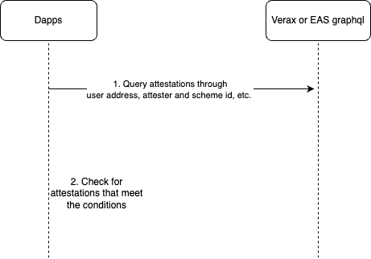
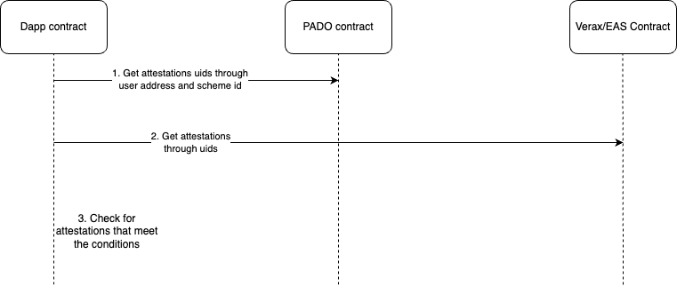

# pado-demo

## Introduction

PADO attestations are based on the [EAS](https://docs.attest.sh/docs/welcome)  and [Verax](https://docs.ver.ax/verax-documentation/) framework. PADO contains two types of proofs, one is api data proof and the other is web page data proof.

Api data proof contains Assets proof and Token Holdings Proof. Assets proof means that a user's account balance on the exchange is greater than a certain value, Token Holdings Proof means that a user holds a certain token on the exchange.

Web page data proof now contains Binance Authentication Proof, Binance Account Ownership proof , and Twitter Ownership proof. We will support more proofs in future.

Now we supported Sepolia、Linea Goerli and Scroll Sepolia Testnet, and Arbitrum One、Linea and Scroll Mainnet. We will support more networks in future.

## Dapps use PADO proof process

Dapps can use PADO proofs in frontend ,backend and contract.

### Use PADO proofs in frontend and backend

We can use the following methods to use PADO proofs:

* Use Verax or EAS graphql to query the PADO attestations, and then verify it.

  

* Use PADO portal and Verax or EAS contract to query the PADO attestations, and then verify it.

### Use PADO proofs in contract



## Demo

Demo main files are [test.js](./scripts/test.js) and [PADODemo.sol](./contracts/PADODemo.sol).

### Run

```shell
1. git clone git@github.com:pado-labs/pado-demo.git
2. cd pado-demo
3. npm install
4. node scripts/test.js
```

## Contracts and schemas and graphql

### Sepolia Testnet

* Contracts

  PADO contract: 0x140Bd8EaAa07d49FD98C73aad908e69a75867336

  Eas contract: 0xC2679fBD37d54388Ce493F1DB75320D236e1815e

* Schemas: [Api data Assets proof](https://sepolia.easscan.org/schema/view/0x45316fbaa4070445d3ed1b041c6161c844e80e89c368094664ed756c649413a9), [Api data Token Holdings Proof](https://sepolia.easscan.org/schema/view/0xe4c12be3c85cada725c600c1f2cde81d7cc15f957537e5756742acc3f5859084), [Web page data proof](https://sepolia.easscan.org/schema/view/0x5f868b117fd34565f3626396ba91ef0c9a607a0e406972655c5137c6d4291af9).

* Graphql

  https://sepolia.easscan.org/graphql

### Linea Goerli Testnet

### Scroll Sepolia Testnet

### Arbitrum One Mainnet

### Linea Mainnet

### Scroll Mainnet


