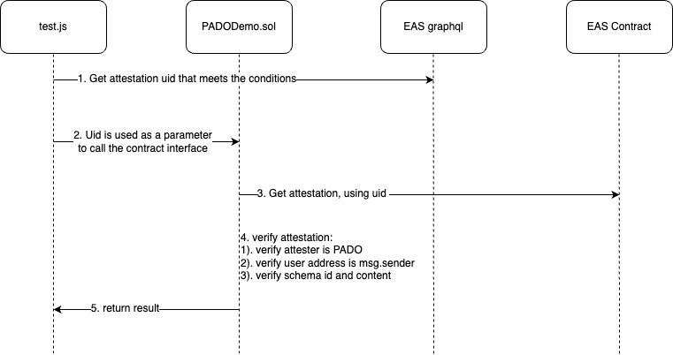

# pado-demo

## Introduction

PADO attestations are based on the [EAS](https://docs.attest.sh/docs/welcome) framework. PADO has created two main schemas on EAS Sepolia, one is [Assets Proof Schema](https://sepolia.easscan.org/schema/view/0x45316fbaa4070445d3ed1b041c6161c844e80e89c368094664ed756c649413a9) and the other is [Token Holdings Proof Schema](https://sepolia.easscan.org/schema/view/0xe4c12be3c85cada725c600c1f2cde81d7cc15f957537e5756742acc3f5859084).

Assets proof means that a user's account balance on the exchange is greater than a certain value, Token Holdings Proof means that a user holds a certain token on the exchange.

## Demo Main process

Demo main files are [test.js](./scripts/test.js) and [PADODemo.sol](./contracts/PADODemo.sol).



## Run

```shell
1. git clone git@github.com:pado-labs/pado-demo.git
2. npm install
3. node scripts/test.js
```


